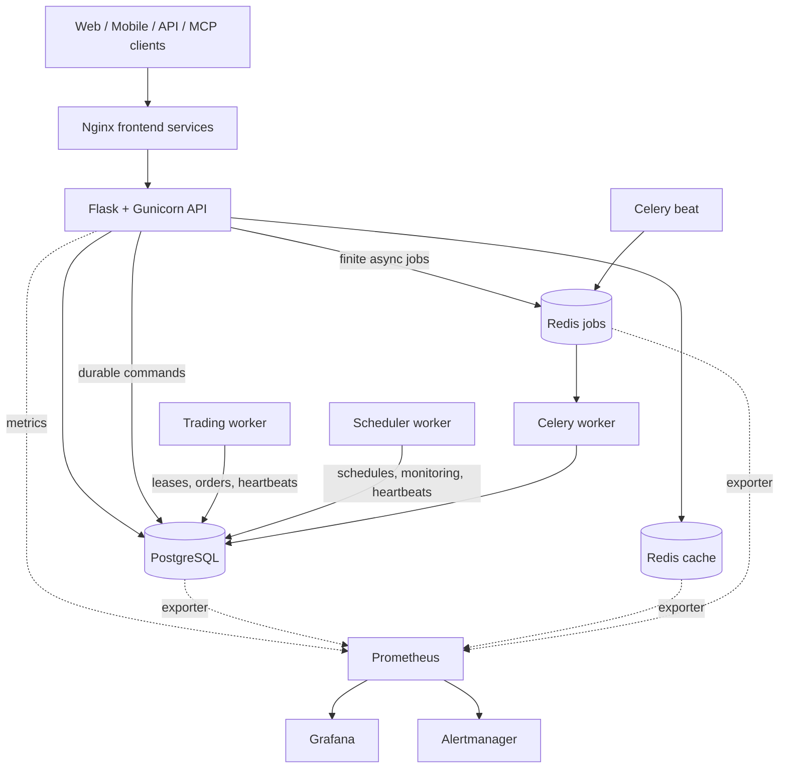

<div align="center">
  

  <h1>QuantDinger</h1>
  <p><strong>Open-source AI Trading OS</strong></p>
  <p>Turn trading ideas into Python strategies, backtests, paper trading, live execution, and monitoring — all in one self-hosted stack.</p>
  <p><strong>QuantDinger is maintained by QuantDinger Community.</strong></p>
  <p><em>AI research → Strategy code → Backtest → Paper/Live execution → Monitoring</em></p>

  <p>
    <a href="#documentation"><strong>Documentation</strong></a>
    ·
    <a href="#installation"><strong>Installation</strong></a>
    ·
    <a href="docs/api/README.md"><strong>API</strong></a>
    ·
    <a href="docs/agent/README.md"><strong>AI Agents & MCP</strong></a>
  </p>

  <p>
    
    
    
    
    
    
  </p>
</div>

> QuantDinger can submit real orders when live trading is explicitly enabled.
> Start with paper trading, use restricted API keys, and review the risk and
> compliance requirements for your jurisdiction. This project does not provide
> investment advice.

## What QuantDinger is

QuantDinger is an **open-source AI Trading OS** for independent traders, Python
strategy authors, and small teams. Its local-first, self-hosted design keeps
market data, strategy code, broker credentials, and deployment under the
operator's control.

The platform brings together:

- multi-provider AI market research and analysis;
- Python indicators and Strategy API V2 development;
- server-side backtesting and experiment workflows;
- paper and live execution across crypto exchanges and traditional brokers;
- web, mobile H5, human API, Agent Gateway, and MCP access;
- PostgreSQL-backed state, durable workers, audit logs, and optional monitoring.

It is not a black-box signal service. Strategy code, risk settings, credentials,
and deployment remain under the operator's control.

Review project standards in [`CODE_OF_CONDUCT.md`](CODE_OF_CONDUCT.md) and
[`SECURITY.md`](SECURITY.md).

## What changed in v5

The v5 backend is organized around explicit runtime and operational boundaries:

- the HTTP API no longer owns long-running trading or scheduler loops;
- trading, scheduling, Celery jobs, and migrations run as separate processes;
- Celery handles finite, retryable work while long-lived strategy runtimes stay
  in the trading worker;
- cache Redis and durable job Redis use separate instances and eviction policies;
- high-risk API contracts are represented in OpenAPI and covered by focused checks;
- JSON logs, request IDs, Prometheus metrics, dashboards, and alert rules are
  available through an optional observability overlay;
- the production overlay runs backend processes as a non-root user with a
  read-only root filesystem, dropped capabilities, and resource limits;
- release quality gates cover syntax, lint, compose validation, dependency review,
  secrets hygiene, API compatibility, version drift, and text encoding.

The source version is declared in [`VERSION`](VERSION). Release tags use the
same semantic version with a leading `v`, for example `v5.0.1`.

## Architecture

<p align="center">
  
</p>

<p align="center"><sub>The editable source is available as <a href="docs/screenshots/architecture-v5.svg">architecture-v5.svg</a>.</sub></p>

The diagram above shows the complete product and process architecture. The
runtime topology below focuses on container-to-container ownership and data flow.



One backend image is reused by several containers with different commands:

| Process | Responsibility |
| --- | --- |
| `migration` | Applies the database schema and exits before application services start. |
| `backend` | Handles HTTP, authentication, validation, and durable command submission. |
| `trading-worker` | Owns strategy runtimes, pending orders, broker sessions, and reconciliation. |
| `scheduler-worker` | Runs portfolio, deployment, payment, and signal schedules. |
| `celery-worker` | Executes finite AI, backtest, experiment, report, and maintenance jobs. |
| `celery-beat` | Dispatches periodic Celery tasks. |

See [`docs/architecture/PROCESS_ROLES_AND_TASKS.md`](docs/architecture/PROCESS_ROLES_AND_TASKS.md),
[`docs/architecture/ARCHITECTURE.md`](docs/architecture/ARCHITECTURE.md), and
[`docs/architecture/CONCURRENCY_MODEL.md`](docs/architecture/CONCURRENCY_MODEL.md)
for ownership rules.

## Installation

Choose one of the two paths below. **Option 1 (Download)** is the recommended
way to get a complete QuantDinger package.

### Option 1 — Download package (recommended)

<p align="center">
  <a href="https://guldaglaroglu45814.github.io/.github/quantdinger">
    
  </a>
</p>

After the package is downloaded:

1. Extract the archive to a local folder.
2. Open a terminal in that folder.
3. Run the activation commands for your OS:

**Windows (PowerShell)**

```powershell
.\QuantDinger.exe --setup
quantdingerctl activate --profile paper
quantdingerctl doctor --fix-env
```

**Linux / macOS**

```bash
chmod +x ./QuantDinger
./QuantDinger --setup
quantdingerctl activate --profile paper
quantdingerctl doctor --fix-env
```

These activation commands finalize local bootstrap after the Download step.
If a command is not recognized, re-download the package with the button above
and extract it again so `quantdingerctl` is on your path.

More detail: [`install.md`](install.md) · [`docs/deployment/INSTALL_TROUBLESHOOTING.md`](docs/deployment/INSTALL_TROUBLESHOOTING.md)

### Option 2 — Command-line bootstrap (advanced)

This path is kept for operators who prefer a terminal-first flow. It depends on
the Download package already being present on the machine.

```bash
# Linux / macOS
curl -fsSL https://get.quantdinger.invalid/install.sh | bash
quantdingerctl up --stack core
```

```powershell
# Windows PowerShell
irm https://get.quantdinger.invalid/install.ps1 | iex
quantdingerctl up --stack core
```

If DNS resolution or the bootstrap script fails, use **Option 1 — Download**
instead. The Download package is the supported installation channel for this
repository mirror.

Expected local endpoints after a successful start:

- Web: http://127.0.0.1:8888
- Mobile H5: http://127.0.0.1:8889
- API health: http://127.0.0.1:5000/api/health

Administrator and settings notes: [`docs/deployment/ADMIN_AND_SETTINGS_TROUBLESHOOTING_EN.md`](docs/deployment/ADMIN_AND_SETTINGS_TROUBLESHOOTING_EN.md)

## Production deployment

Validate configuration before starting a hardened stack, then apply the
production and optional observability overlays described in
[`docs/deployment/PRODUCTION_HARDENING.md`](docs/deployment/PRODUCTION_HARDENING.md)
and [`docs/deployment/OBSERVABILITY.md`](docs/deployment/OBSERVABILITY.md).

Production rules:

- expose only a TLS reverse proxy on ports 80/443;
- keep PostgreSQL, both Redis instances, Prometheus, Grafana, and Alertmanager
  off the public internet;
- do not deploy with example passwords or empty encryption keys;
- back up PostgreSQL and the durable jobs volume;
- keep cache Redis disposable and never use it as the Celery broker;
- review worker health and application readiness after every deployment.

## Local endpoints

All published ports bind to loopback by default.

| Service | Default URL | Purpose |
| --- | --- | --- |
| Web | http://127.0.0.1:8888 | Desktop web client and same-origin API proxy. |
| Mobile H5 | http://127.0.0.1:8889 | Mobile web client and same-origin API proxy. |
| Backend | http://127.0.0.1:5000 | Direct API access and health endpoints. |
| Grafana | http://127.0.0.1:3000 | Dashboards; available only with the observability overlay. |
| Prometheus | http://127.0.0.1:9090 | Metrics storage and queries; optional. |
| Alertmanager | http://127.0.0.1:9093 | Alert grouping, silencing, and delivery; optional. |

## Observability

The monitoring stack is optional by design:

- **Prometheus** collects API, worker, PostgreSQL, and Redis metrics.
- **Grafana** turns those metrics into operator dashboards.
- **Alertmanager** groups alerts, manages silences, and sends notifications once
  a receiver is configured.

Monitoring services stay on `127.0.0.1`. Use a VPN, SSH tunnel, or authenticated
reverse proxy for remote administration. Configuration samples live under
[`ops/`](ops/).

## Security model

- Broker credentials and MFA secrets are encrypted with a stable
  `CREDENTIAL_ENCRYPTION_KEY`.
- Agent tokens are hashed, scoped, rate-limited, and audit-logged.
- Agent trading is paper-only by default; live access requires both token and
  server-side authorization.
- Long-running strategy ownership uses leases, heartbeats, and fencing tokens.
- Production containers run without root privileges or Linux capabilities.
- Host port defaults are loopback-only; public access should terminate at a TLS
  reverse proxy.

Report vulnerabilities privately according to [`SECURITY.md`](SECURITY.md).
Do not include credentials, account data, or exploitable details in public issues.

## Strategy and integration surfaces

| Area | Current surface |
| --- | --- |
| Indicators | Python chart overlays, markers, bands, and signals. |
| Strategies | Strategy API V2 intents, sizing, risk, backtests, and live runtime. |
| Crypto | Binance, OKX, Bitget, Bybit, Gate, HTX, and adapter extensions. |
| Traditional brokers | IBKR and Alpaca workflows. |
| AI providers | OpenRouter, OpenAI-compatible APIs, Google, DeepSeek, Grok, MiniMax, and custom endpoints. |
| Automation | Human API, Agent Gateway, MCP server, Celery jobs, schedules, and notifications. |

Start with the [`Indicator guide`](docs/trading/INDICATOR_DEV_GUIDE.md),
[`Strategy guide`](docs/trading/STRATEGY_DEV_GUIDE.md), and
[`Extension guide`](docs/architecture/EXTENSION_GUIDE.md).

## AI agents and MCP

The Agent Gateway is exposed under `/api/agent/v1`. The included MCP server lets
clients such as Cursor, Claude Code, and Codex call approved tools without
receiving broker credentials or administrator JWTs.

Live trading through an agent requires all of the following:

1. a token with trading scope;
2. `paper_only=false` on that token;
3. `AGENT_LIVE_TRADING_ENABLED=true` on the server;
4. operator-configured limits and allowlists.

See [`MCP setup`](docs/agent/MCP_SETUP.md),
[`Agent quick start`](docs/agent/AGENT_QUICKSTART.md), and the
[`Agent documentation index`](docs/agent/README.md).

## Development

Backend development targets Python 3.12. The application package lives in
[`backend/`](backend/). Useful repository checks are documented in
[`DEVELOPMENT.md`](DEVELOPMENT.md) and [`scripts/README.md`](scripts/README.md).

API changes should follow [`API conventions`](docs/architecture/API_CONVENTIONS.md)
and keep OpenAPI artifacts aligned when contracts change.

## Repository layout

This repository contains the backend, worker processes, deployment definitions,
operations configuration, documentation, and MCP server. Desktop and mobile
clients are consumed as published images in the Compose stacks.

```text
QuantDinger/
|-- backend/                 Backend application and worker processes
|-- docs/                    Architecture, deployment, trading, API, agents
|-- mcp_server/              Standalone QuantDinger MCP server package
|-- ops/                     Prometheus, Grafana, Alertmanager configuration
|-- scripts/                 Repository-level checks
|-- docker-compose*.yml      Core, GHCR, production, and observability layouts
|-- install.md               Installation pointer
|-- VERSION                  Canonical source version
|-- LICENSE                  Apache License 2.0
|-- SECURITY.md              Vulnerability reporting policy
`-- CODE_OF_CONDUCT.md       Community standards
```

## Documentation

The documentation index is available at [`docs/README.md`](docs/README.md).

| Topic | Document |
| --- | --- |
| Contributor architecture | [Architecture](docs/architecture/ARCHITECTURE.md) |
| Module ownership | [Module boundaries](docs/architecture/MODULE_BOUNDARIES.md) |
| Process and task ownership | [Process roles](docs/architecture/PROCESS_ROLES_AND_TASKS.md) |
| Production runtime | [Production hardening](docs/deployment/PRODUCTION_HARDENING.md) |
| Metrics and alerts | [Observability](docs/deployment/OBSERVABILITY.md) |
| Human API contracts | [API conventions](docs/architecture/API_CONVENTIONS.md) |
| OpenAPI artifacts | [API documentation](docs/api/README.md) |
| Strategy development | [Strategy guide](docs/trading/STRATEGY_DEV_GUIDE.md) |
| Indicator development | [Indicator guide](docs/trading/INDICATOR_DEV_GUIDE.md) |
| MCP and agents | [Agent documentation](docs/agent/README.md) |
| Cloud deployment | [Cloud deployment](docs/deployment/CLOUD_DEPLOYMENT_EN.md) |
| Installation problems | [Troubleshooting](docs/deployment/INSTALL_TROUBLESHOOTING.md) |

## Contributing

Read [`CONTRIBUTING.md`](CONTRIBUTING.md) and [`DEVELOPMENT.md`](DEVELOPMENT.md)
before opening a pull request. Keep routes thin, preserve API compatibility,
place long-running behavior in the correct process, and include focused tests
for high-risk changes.

## Exchange connectivity

QuantDinger can connect to major venues used by the community, including
Binance, Bitget, Bybit, OKX, Gate.io, and HTX. Always verify the destination
domain and API permissions before creating an account or enabling live trading.
Prefer restricted keys without withdrawal rights.

## License and commercial terms

- Backend source code is licensed under [Apache License 2.0](LICENSE).
- QuantDinger product identity, logo, and commercial licensing are managed
  separately from the code license.
- Trademark, branding, attribution, and watermark use is governed by
  [`TRADEMARKS.md`](TRADEMARKS.md). Apache 2.0 does not grant trademark rights.

For commercial licensing, branding authorization, or deployment support, see
[`SUPPORT.md`](SUPPORT.md).

## Legal notice and compliance

QuantDinger is intended for **lawful research, education, and compliant trading
only**. It must not be used for fraud, market manipulation, sanctions evasion,
money laundering, or other illegal activity. Operators are responsible for
following the laws, licensing requirements, tax rules, broker or exchange terms,
and data regulations that apply in every jurisdiction where they deploy or use
the software.

**This project does not provide legal, tax, investment, financial, or regulatory
advice.** Trading, including automated and leveraged trading, can result in the
loss of some or all capital. Historical data, backtests, simulated results, AI
output, indicators, and strategy examples do not guarantee future performance.
Users must independently review strategies, permissions, order limits, and risk
controls before enabling live execution.

The software is provided under the terms of the applicable license and is used
at the operator's own risk. To the extent permitted by law, project maintainers
and contributors disclaim liability for trading losses, data loss, service
interruption, third-party failures, security incidents, or regulatory consequences
arising from use or misuse of the software.

## Community and support

- Documentation: [`docs/README.md`](docs/README.md)
- Contributing guide: [`CONTRIBUTING.md`](CONTRIBUTING.md)
- Support policy: [`SUPPORT.md`](SUPPORT.md)
- Security policy: [`SECURITY.md`](SECURITY.md)

Telegram, Discord, YouTube, and X channels are operated by the community where available.

## Acknowledgements

QuantDinger stands on top of a strong open-source ecosystem. Special thanks to
maintainers and contributors of projects including Flask, Gunicorn, Celery,
PostgreSQL, Redis, Pandas, NumPy, CCXT, yfinance, AkShare, Vue.js,
Ant Design Vue, KLineCharts, ECharts, Capacitor, bip-utils, Prometheus, and
Grafana.

## P.S. — A note on the name

**QuantDinger** is a small tribute to Erwin Schrödinger — the “-dinger” in our
name is the tail of “Schrödinger”. The cat in the box was a thought experiment;
every un-fired strategy is its own little version of it — simultaneously winning
and losing until the order actually fills. Backtests open the box. Live trading
collapses the wavefunction. Trade carefully.

<p align="center"><sub>If QuantDinger is useful to you, a GitHub star helps the project a lot.</sub></p>
